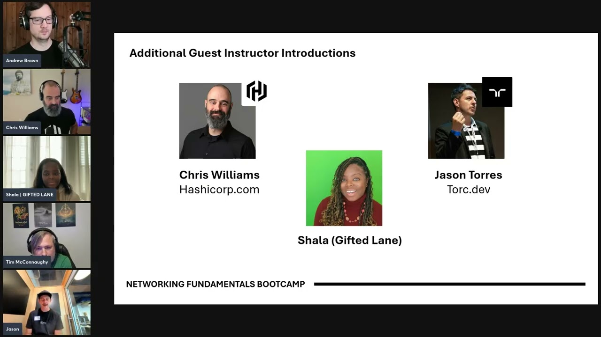

# exp-net-fundamentals-2025-Q2

## Technical Video Demostration

In the video I architect a local Media Server between two houses with a Network Engineer, Cloud Engineer and a Solutions Architect. (2 hour)

### Key Highlights of Video
- [Traffic Walk Through The  Diagram 51:50 (3 mins)](https://youtu.be/jBpy4_bU5Pk?si=mZvw-8-H4Ve5D1yu&t=3110)

## Design Considerations

### Why do they have same IP Adress Spaces In Each House?
We have a flat network. We Implemented the Basic IP Schema for both houses because it was a flat network. Ideally you would not have overlapping networks

### Why not wired connection?
We used a wirless bridge because it was winter and we could not trench frozen ground. Ideally we run a wired line.

- [Full Technical Journal]()

## Journal

- [Lesson 1]()
- [Lesson 2]()
- [Lesson 3]()
- [Lesson 4]()