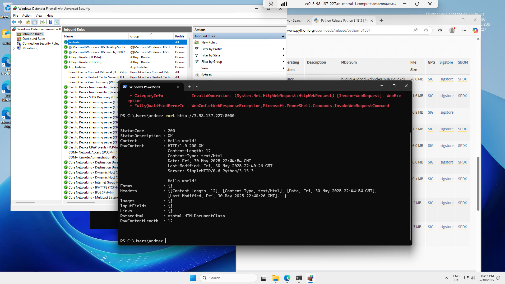

## Firewall Rules Testing Locally

When attempting to test Firewalls locally, we determine its hard to test when you are using localhost because Firewalls rules will not block on the same network so we need to attempt to access the network on a difference machine

## AWS Windows Server, Serving Simple Website

We we able to start a web server using python to serve a single static page

The firewall rules block everything that does not have a inbound rule.

We added an inbound rule for port 8000, from our local machine we used CURL and were able to the server

We also had to remember to open port 8000 on our AWS Security Group.

